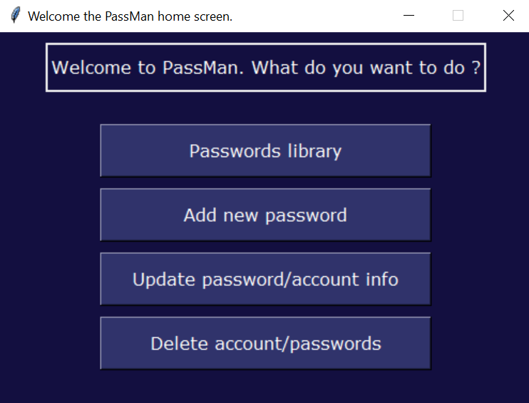
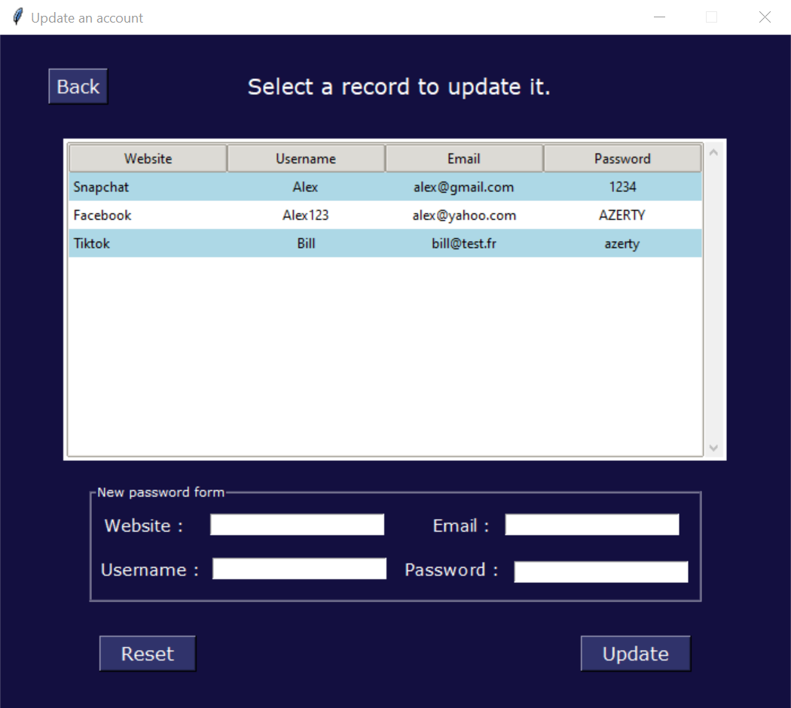

# 🔐 PasswordManager 🔐

## About the project

Project built to self familiarization with tkinter, sql queries, database access, hashing and encryption and ultimately building a python application. Completely offline.

Allows to create, read, update and delete accounts and respective passwords. Copy to clipboard enabled.

 

## Table of Contents

- [Project Organization](#project-Organization)
- [Features and uses](#features-and-uses)
- [Technologies & packages](#technologies-&-packages)
- [Screenshots](#screenshots)
- [Credits](#screenshots)

 

## Project Organization

    ├── database          
    │    └── pass.db                  <- Sqlite database file
    │
    ├── img                           <- Folder containing images for the project
    ├── scripts
    │   ├── Password_manager.py       <- App main script
    │   │
    │   ├── database_management.py    <- Creates and closes database connections
    │   │
    │   └── encryption_decryption.py  <- Functions to encrypt and decrypt the database
    │
    ├── LICENSE                       <- MIT License
    │
    ├── Notes.md                      <- Notes along the project.
    │
    └── README.md                     <- The top-level README
 

## Features and uses 💻

- App GUI with python
- Login with hashed password
- Sqlite database records encrypted (symmetric)
- Create records (Website, username, email and password)
- Read records
- Update records
- Delete records
- Copy passwords to clipboard

 

## Technologies & packages 🔧

&rarr; Python,  used for the backend  
&rarr; Sqlite, for the database  
&rarr; Tkinter, for the frontend    
&rarr; Fernet, for the symmetric encryption of the database   
&rarr; Bcrypt, for the hashing of the main password  
&rarr; Pyperclip, to copy to clipboard   

 

## Screenshots 📷

- #### Homepage  

    

- #### Update page

    

 

## Credits 🤝

- [Stack Overflow](https://stackoverflow.com/)
- [Geeks For Geeks](www.geeksforgeeks.org)
- [Tkinter Doc](https://docs.python.org/3/library/tkinter.html)
- ...
